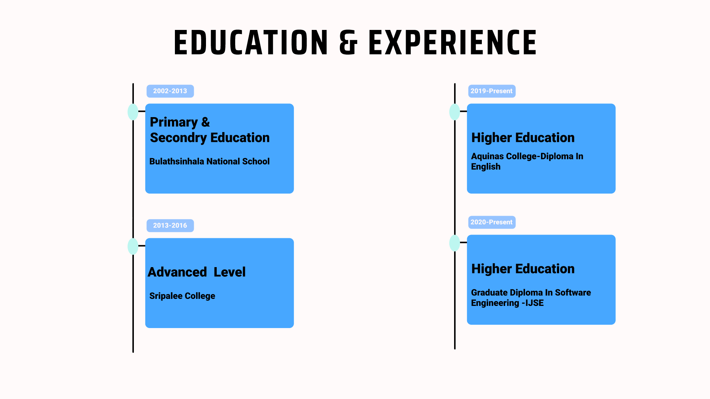
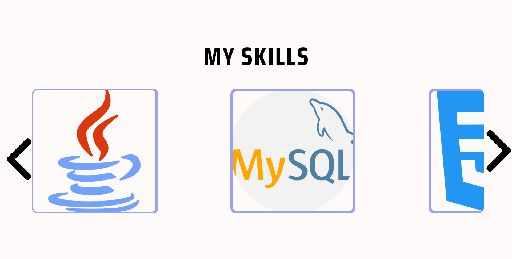
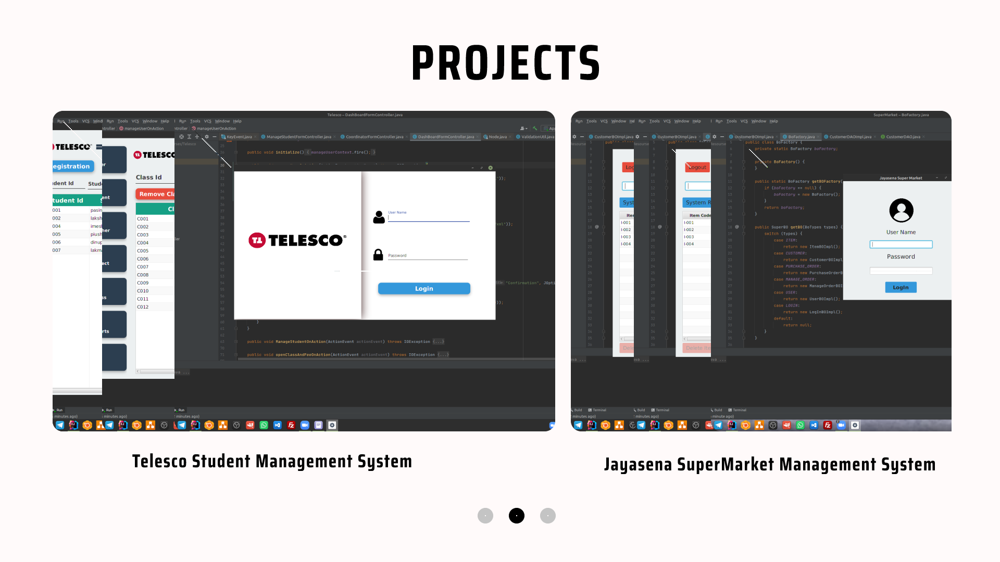
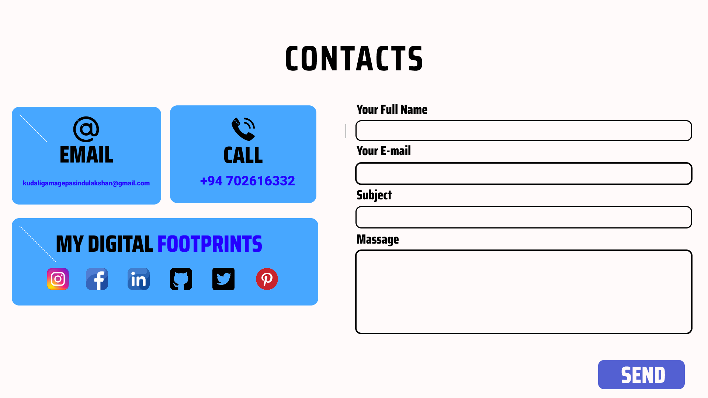

<h1 align="center">**This is my profile**</h1>

### 🅿🆁🅾🅵🅸🅻🅴 🆅🅸🅴🆆🆂 🕵️‍♂️
- My primary coding language : Java 🧒
- Graduate in Software Engineering at IJSE 👨‍🎓
- Proud to be Sripalian. 💙🧡
- Programming Skills : Java, HTML, CSS, JavaScript, NodeJS
- Design Skills : AdobeXD, Figma

Format: 

Format: 

<h2>Overview My Profile🕵️‍♂️ </h2>

<h3 align="center">Home Section🧒</h3>

<h3 align="center">About Me</h3>

<h3 align="center">Education & Experience</h3>

<h3 align="center">My Skills</h3>

<h3 align="center">Projects</h3>

<h3 align="center">Contacts</h3>

## :link: **Links**
- Website : [PasinduLakshanKudaigama](https://pasindulakshankudaligama.000webhostapp.com/)
- GitHub-Pages : [PasinduLakshanKudaligama.github.io](https://github.com/pasindulakshankudaligama)
- Site Map : [Click Here](https://www.gloomaps.com/zkW7hEsEkx)
- Wireframe : [Click Here](https://wireframe.cc/0EsPjQ)
- Mockup : [Click Here](https://www.figma.com/file/ODNGUckoFcQyn5RFkvqQfQ/My-Web?node-id=0%3A1)

<a href="https://github.com/pasindulakshankudaligama/Readme-File-Styles">
Pasindu Lakshan Kudaligama Readme Profile Styles here ! ✌
</a>

  

