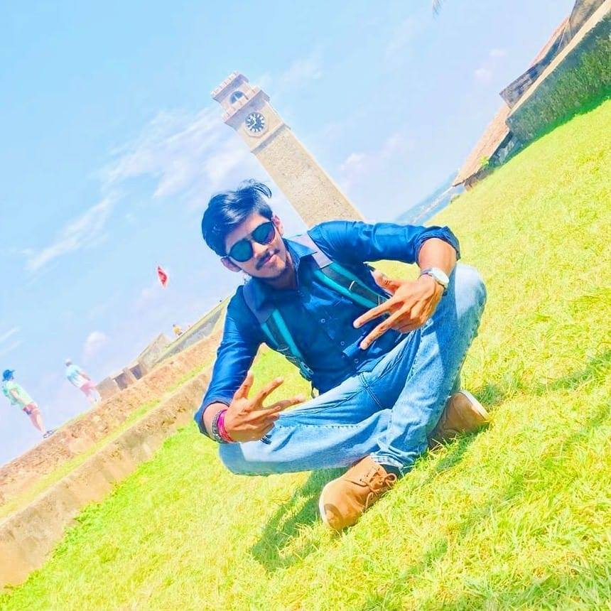
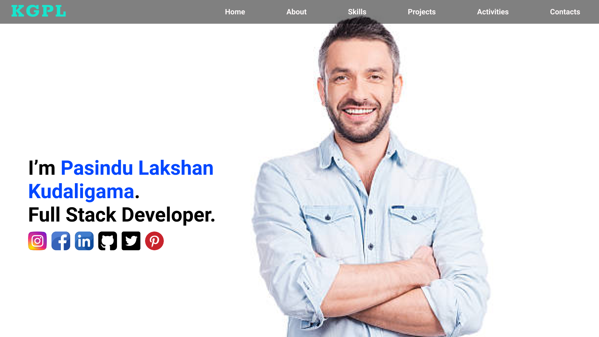

<h1 align="center">**This is my profile**</h1>

### 🅿🆁🅾🅵🅸🅻🅴 🆅🅸🅴🆆🆂 🕵️‍♂️
- My primary coding language : Java 🧒
- Graduate in Software Engineering at IJSE 👨‍🎓
- Proud to be Sripalian. 💙🧡
- Programming Skills : *Java, HTML, CSS, JavaScript, NodeJS
- Design Skills : *AdobeXD, Figma

Format: 

Format: 

<h2>My Web Site View🕵️‍♂️ </h2>
<h3 align="center">About Section🧒</h3>

<a href="https://github.com/pasindulakshankudaligama/Readme-File-Styles">
Pasindu Lakshan Kudaligama Readme Profile Styles here ! ✌
</a>

  

